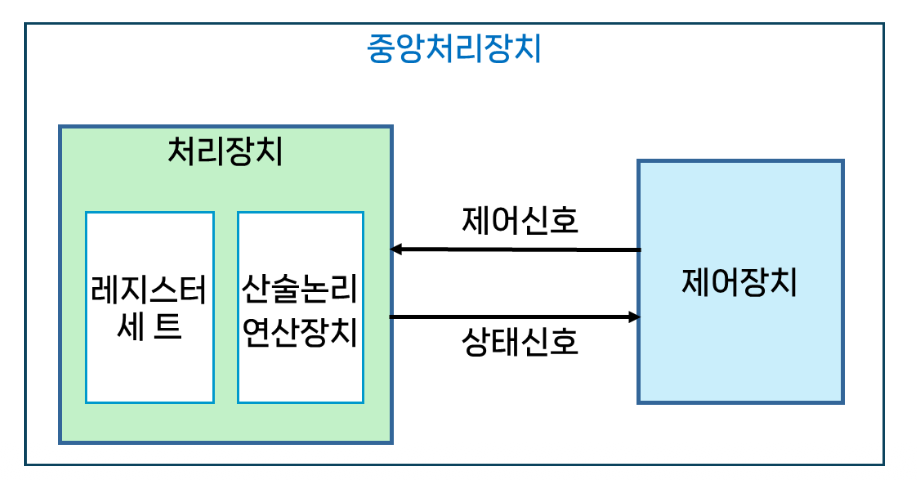
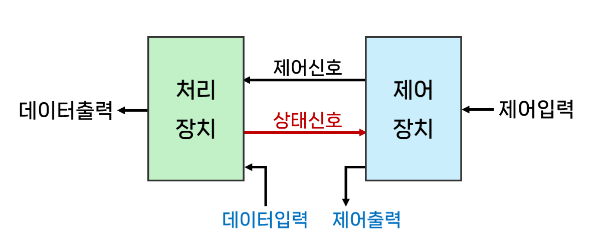
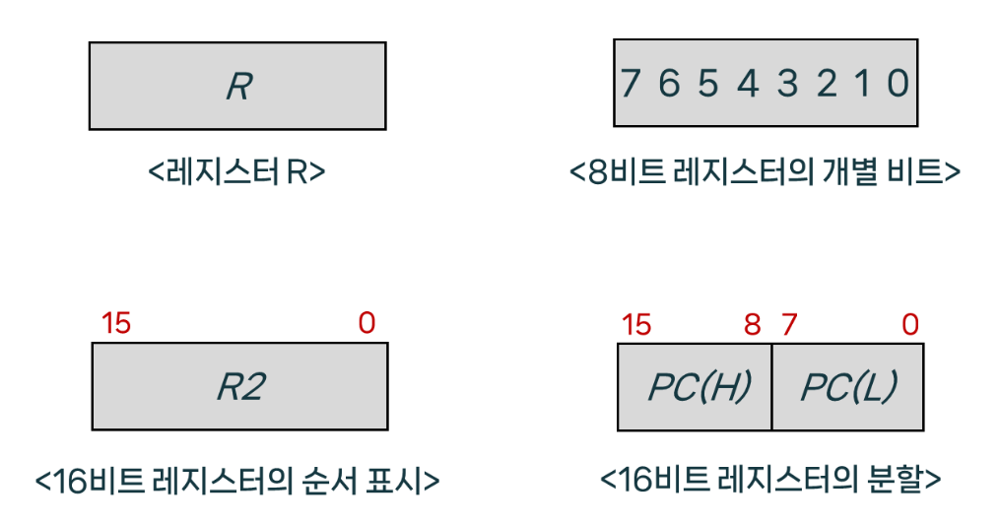
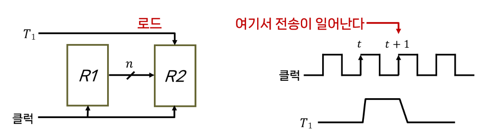
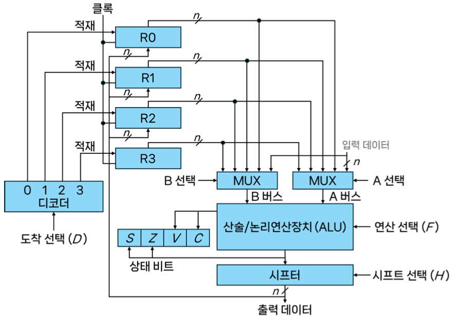
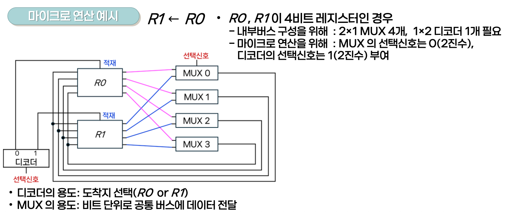

# 4강.처리장치(I)

## 1. 처리장치의 개요
### 중앙처리장치(CPU: Central Processing Unit)
> 처리 장치와 제어장치가 결합된 형태
- 처리장치: 데이터를 처리하는 연산을 수행
- 제어장치: 연산의 실행순서를 결정



- 처리장치와 제어장치의 관계


처리장치에서는 레지스터 수준의 작은 명령어 실행

### 처리장치의 구성
- `산술논리연산장치`와 다수의 `레지스터`로 구성된다.

**산술논리연산장치(ALU: Arithmetic and Logic Unit)**
- 산술, 논리, 비트연산 등의 연산을 수행

**레지스터(Regiseter)**
- 연산에 사용되는 데이터나 `연산의 결과를 저장`

> ALU는 `연산을 수행하는 기능만을 담당`하며 연산에 필요한 데이터는 레지스터를 통해서 공급되고 결과도 레지스터에 저장됨

## 2. 마이크로 연산

### 마이크로 연산
- 레지스터에 저장되어 있는 데이터에 대해 이루어지는 `기본적인 연산`
    - 레지스터와 연산 회로 수준에서 수행되는 가장 기본적인 회로 단위의 동작
        - 한 레지스터의 내용을 다른 레지스터로 옮긴다
        - 두 레지스터의 내용을 합친다
        - 레지스터의 내용을 1만큼 증가시킨다.

- `ALU`, `레지스터`, `버스` 등의 회로 자원을 사용
마이크로 연산의 동작을 이해해야 처리장치의 동작원리를 이해할 수 있따.

**마이크로 연산의 종류**
- 레지스터 전송 마이크로 연산(register-transfer micro-operation) - 전송
- 산술 마이크로 연산(arithmetic micro-operation) - 처리
- 논리 마이크로 연산(logic micro-operation) - 처리
- 시프트 마이크로 연산(shift micro-operation) - 처리

### 레지스터 전송 마이크로 연산

레지스터를 표현하는 방법


- PC는 Program Counter를 의미

### 레지스터 전송 마이크로 연산
- 한 레지스터에서 다른 레지스터로 2진 데이터를 전송하는 연산
레지스터 사이의 전송은 <- 로 표시

레지스터 R1의 내용을 레지스터 R2로 전송
```
R2 <-R1
```
R1: 출발 레지스터(source register)
R2: 도착 레지스터(destination register)

### 하드웨어 측면에서 레지스터 전송

- R2 <- R1: 레지스터 R1의 내용을 R2로 전송

- 공통 클럭을 공유
- T1 = 1 인 상태에서 R1에서 R2로의 데이터 전송
- 디지털 회로에서는 클럭의 상승 또는 하강 시점에만 데이터를 갱신
- 그림에서 T1=1 인 클럭의 시점에 데이터를 전송하는 것을 의미
- t+1 일때 R1에서 R2로 데이터 전송이 일어남

**조건문으로 표현**
```
if(T1=1) then(R2<-R1)
```

**레지스터 전송문 표현**
```
T1: R2<-R1
```

레지스터 전송문에서 사용되는 기호

| 기호 | 의미 | 사용예시 | 설명 |
|------|------|----------|------|
| 영문자 | 레지스터를 표시 | AR, R2, DR, IR | CPU 안에서 데이터를 임시 저장하는 기억장치. AR: 주소, DR: 데이터, IR: 명령어, R1/R2: 일반 계산용 |
| 괄호 | 레지스터의 일부 | R2(1), R2(7:0), AR(1) | 레지스터 내 특정 비트 혹은 비트 범위를 선택할 때 사용 |
| 화살표 | 자료의 이동 표시 | R1 <- R2 | 데이터 이동 방향을 나타냄. 왼쪽이 목적지, 오른쪽이 출발지 |
| 쉼표 | 동시에 실행되는 두 개 이상의 마이크로 연산 | R1 <- R2, R2 <- R1 | 한 줄에 동시에 수행되는 연산을 나타냄 |
| 대괄호 | 메모리에서의 어드레스 | DR <- M[AR] | 대괄호 안 주소에 있는 메모리 값을 참조. 예: AR 주소의 데이터를 DR로 가져오기 |

## 3. 처리장치의 구성 요소

### 처리장치의 내부 구성
- 여러개의 레지스터(레지스터 세트)
- 내부 버스(internal bus)
- 산술논리연산장치(ALU)

ALU <--bus--> Register

**처리장치의 동작**
- 처리장치는 내부 구성 요소들을 사용해 `마이크로 연산`을 수행한다.

**마이크로 연산의 수행과정**
1) 지정된 출발 레지스터의 내용이 ALU의 입력으로 전달
2) ALU에서 그 연산을 수행
3) 그 결과가 도착 레지스터에 전송



- **처리장치에서 연산 수행 과정**
- 예) R0 <- R1 + R2
    - 1 . 입력된 선택신호에 따라서 버스에 적재(R1 => A, R2 => B)
    - 2 . MUX에서 여러개의 레지스터중 하나를 선택
    - 3 . ALU에서 산술연산 A+B 연산 수행
    - 4 . 상태 레지스터에서 상태를 갱신
    - 5 . 시프터에서 시프트 연산을 수행(덧셈의 경우 별도수행x)
    - 6 . 디코더를 통해서 연산 결과를 R0에 적재

**멀티플렉서와 디코더**
모든 레지스터와 연산장치가 버스로 연결되어는데 신호를 제어하기 위해서 스위치로 구성하면 비용이 너무 많이 발생한다. 그래서 멀티플렉서를 별도로 구성하여 신호를 제어한다.

- 멀티플렉서는 출발 레지스터를 선택
- 디코더는 도착 레지스터를 선택

### 내부버스의 구성 및 동작


- 4bit 레지스터 2개로 구성시 4개의 MUX로 구성
- 레지스터의 개수가 2개이므로 1x2 디코더로 구성


