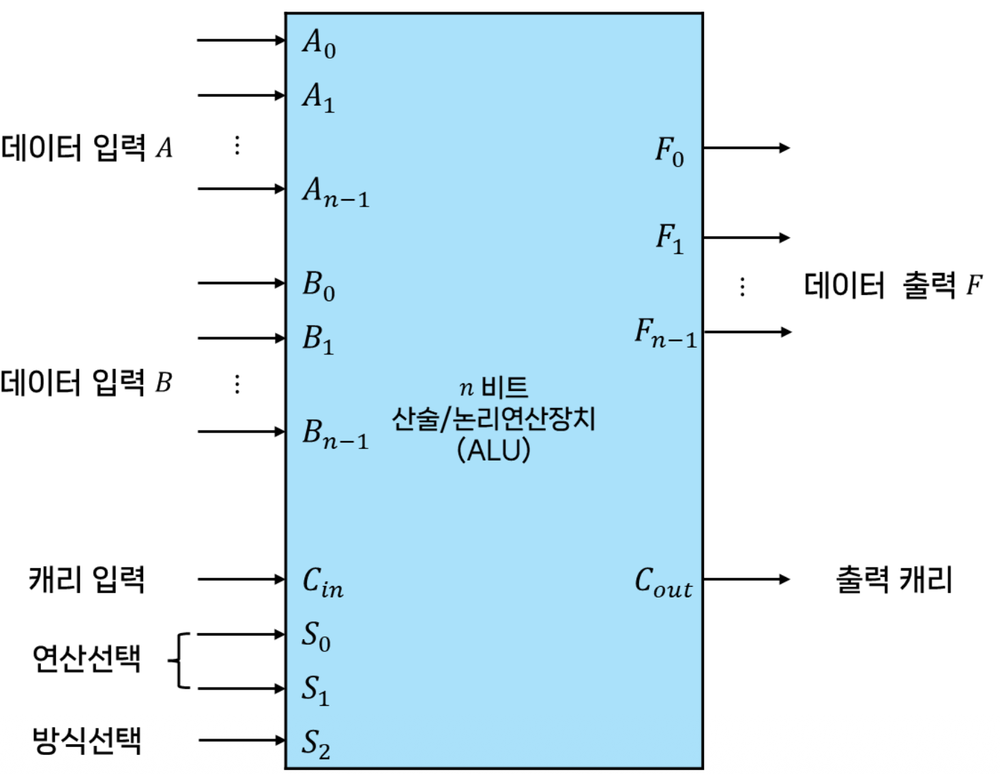
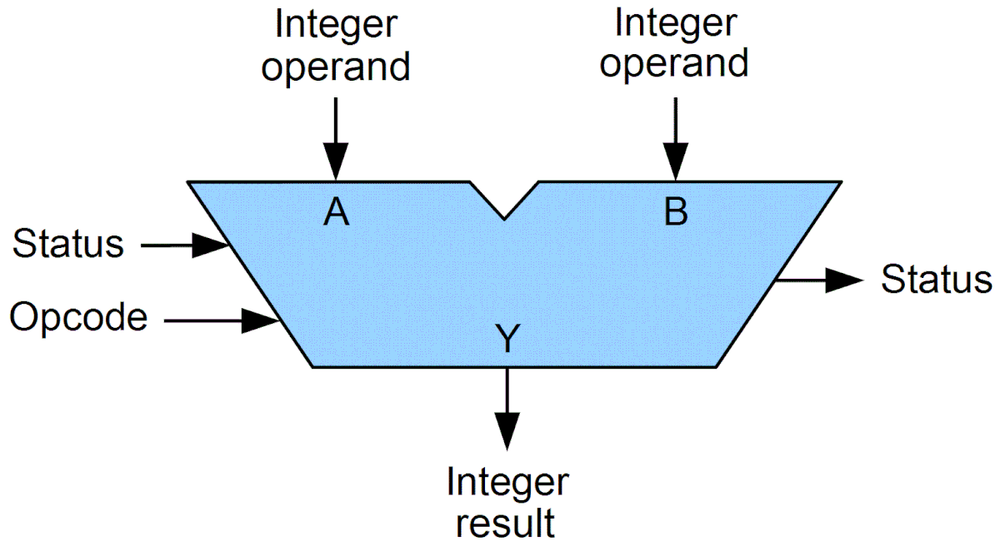
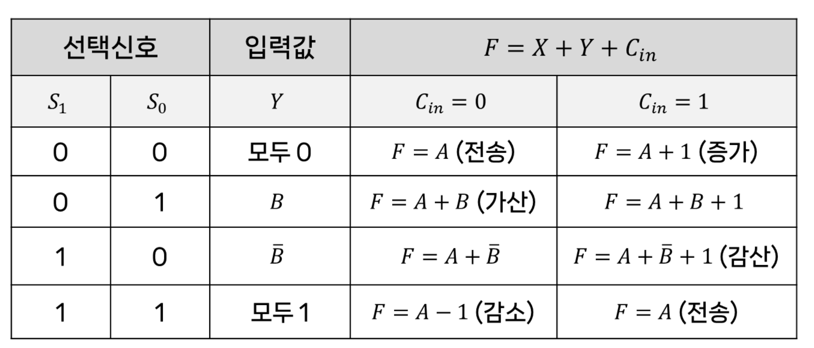
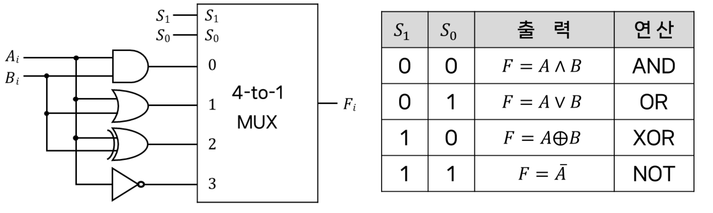
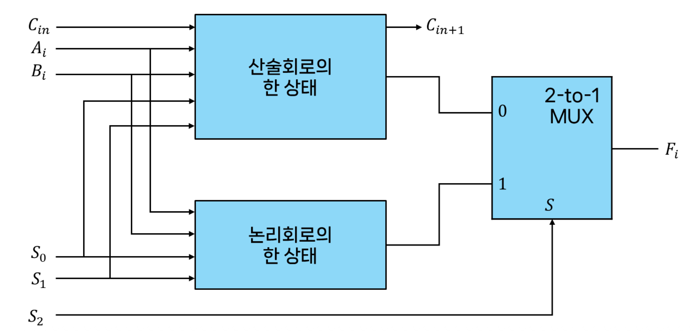
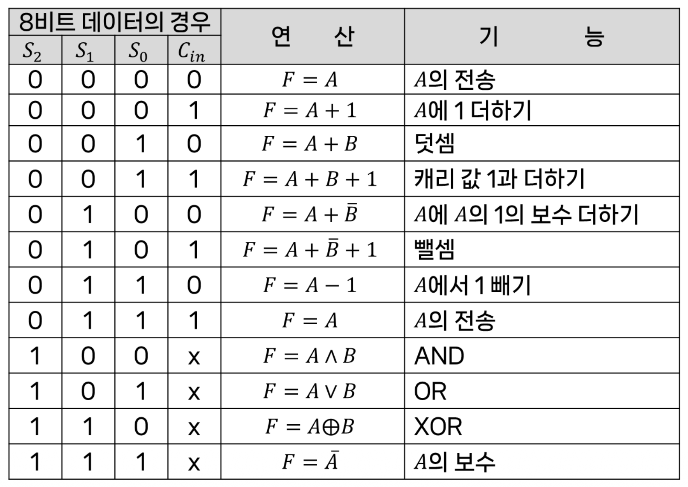
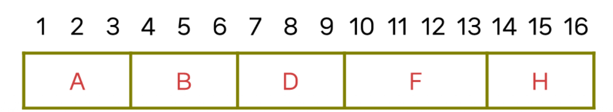

# 5강. 처리장치(II)

## 산술논리연산장치
컴퓨터에서 산술 또는 논리연산을 수행하는 연산회로

**처리 과정**
데이터 입력(A, B) -> 방식 선택(제어 신호) -> 2진수 or Bool 

### 산술연산회로

- 여러개의 전가산기를 연속적으로 연결한 병렬가산기로 구성
- 병렬가산기로 들어가는 제어입력 값을 선택하여 여러 형태의 산술연산을 실행
- B 입력변환 논리회로에서 어떤 연산을 수행할지 결정
- Cin은 자리 올림

### 산술연산의 종류

- 선택신호 S1, S0에 따라서 어떠한 연산을 수행해서 ALU에 입력된 변수의 값을 처리할지 결정한다.
- Cin 값에 따라서 1을 증가한다.
- 선택신호 0이 입력된 경우 ALU 레지스터의 값을 그대로 전송하거나 캐리값에 따라서 1을 증가시킨다.
- 선택신호 0,1 이 입력된경우 ALU에 저장된 A값과 B를 가산한다.
- ALU에서 처리한 결과는 다른 레지스터로 전송한다.

### 논리연산회로

- 선택신호 S1, S0에 따라서 어떤 논리연산을 수행할지 결정

### 산술논리연산장치

위에서 설명한 산술연산회로와 논리연산회로가 결합된 형태

- S2에 의해서 산술연산 또는 논리연산을 수행한다.

- S2가 0인경우 산술연산을 수행
- S2가 0인경우 논리연산을 수행

## 상태 레지스터(flag register)
ALU에서 처리한 상태값을 저장

C(carry bit): 올림작업이 있었는지 여부
S(sign bit): 부호
Z(zero bit): 연산결과가 0인지 여부
V(overflow bit): overflow 발생 여부

- 입력값 A, B 입력
- S2 신호에 의해서 산술 또는 논리연산을 수행
- S1, S2로 연산의 종류 결정
- 연산결과를 기반으로 각 상태 레지스터 저장

## 제어단어

### 제어단어(control word)
- 제어변수(선택신호)의 묶음, 제어변수를 집합으로 표현한 것
- 처리장치의 구성요소를 어떻게 작동시킬지 결정하는 비트배열

### 제어변수(선택신호)
- 처리장치내에서 수행되는 마이크로 연산을 선택하는 변수
    - 선택신호 즉, 제어변수가 특정한 마이크로 연산을 수행

처리장치의 ALU, 버스 쉬프터 도착레지스터 각각에 대해서 어떤 마이크로 연산을 수행할지 도착 레지스터를 결정하는 행위를 제어단어가 처리한다.

### 제어단어 처리장치 구성 예시
- 7개의 레지스터(R1~R7)
- 산술논리연산장치
    - 12가지 연산을 수행
- 시프터 
    - 6가지 연산을 수행

각 장치를 제어하기 위한 제어비트 구성

각각의 필드 역할
A 필드 - ALU로 입력되는 7개의 레지스터중 하나를 선택해야 함(3bit)
B 필드 - ALU로 입력되는 7개의 레지스터중 하나를 선택해야 함(3bit)
F 필드 - ALU에서 수행하는 12가지 연산을 선택해서 수행해야 함(4bit)
D 필드 - ALU에서 처리된 결과를 저장할 도착레지스터를 선택해야 함(3bit)
H 필드 - 시프터에서 선택할 6가지 연산중 하나를 선택(3bit)

### 제어단어 생성을 위한 효과적인 방법
- ALU는 단순히 연산을 처리하며 전체적인 실행흐름을 알고있는 제어장치에서 제어단어를 관리하는게 효율적이다.
- 이러한 제어단어를 저장하기위한 제어기억장치에서 제어단어를 조회하는 방식으로 사용한다.
- 제어기억장치의 출력을 처리장치 각 구성요소의 선택신호로 연결
    - 기억장치에서 연속적인 제어단어를 읽고 처리장치에서는 마이크로연산이 순서대로 연속적으로 수행됨

제어장치에서 연속적으로 제어단어를 읽어오고 전달받은 제어단어에 따라서 연속적인 마이크로 연산을 수행