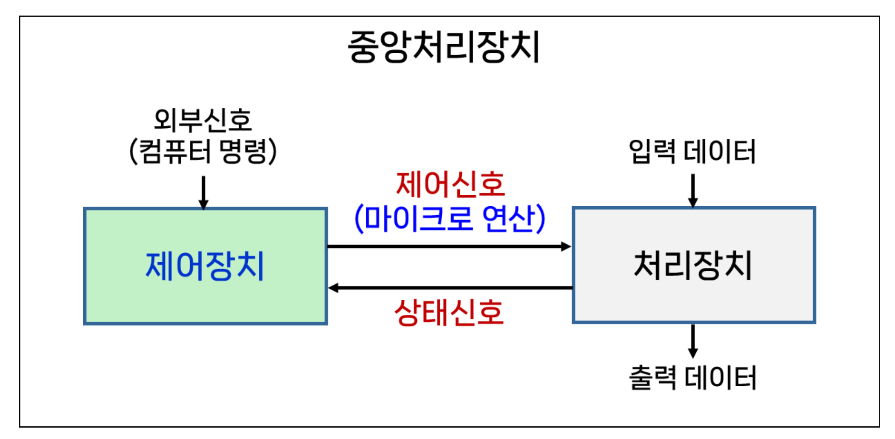
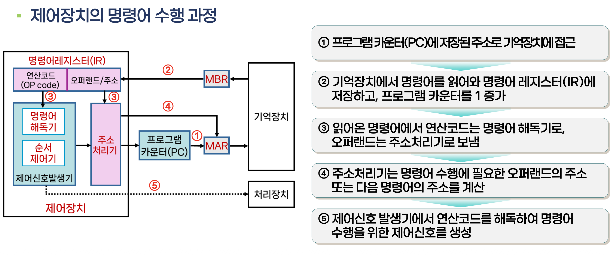
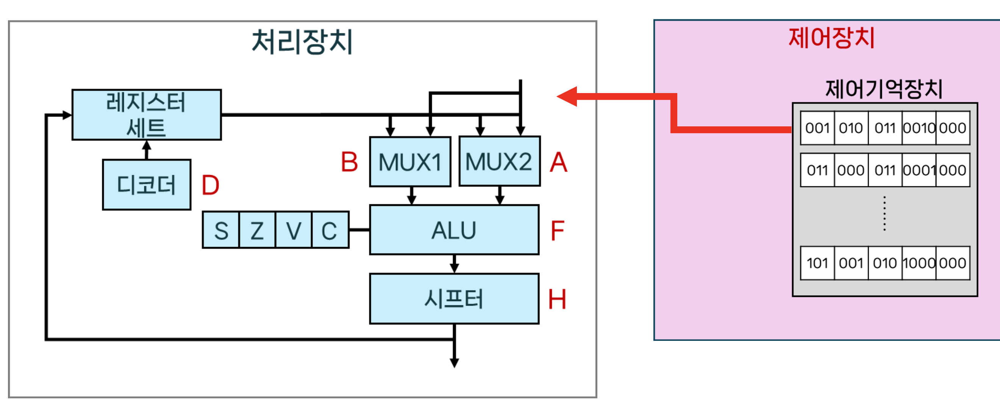
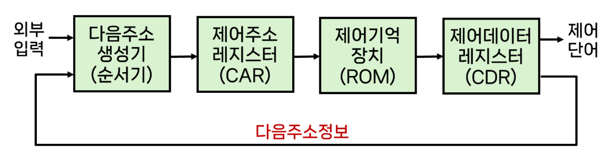
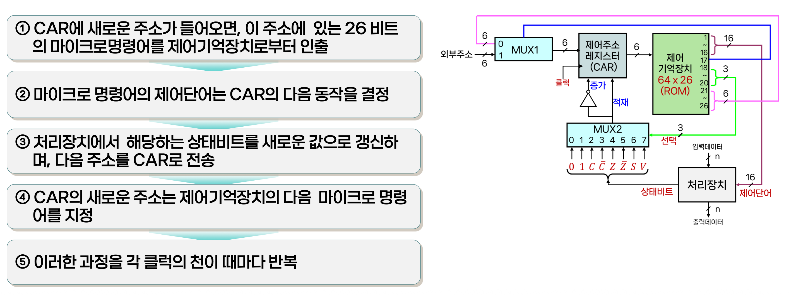

# 06.제어장치(I)

## 제어장치의 개요, 구성, 구현 방법

### 제어장치(Control Unit)
- 컴퓨터 시스템의 모든 장치들을 유기적으로 제어하는 장치

- 기억장치(메모리)에 저장된 프로그램으로부터 명령어를 순차적으로 읽어와서 연산코드(Opcode)를 해독(Decode)

### Opcode(Operation Code)란?
CPU에게 명령을 시키기 위해서 필요한 2진수 형태의 바이너리코드

### 제어장치와 처리장치의 관계

제어장치는 처리장치에게 제어신호를 전달하고 그걸받은 처리장치는 적절한 연산을 수행하고 상태레지스터를 갱신한뒤 제어장치에게 상태신호를 전달

### 제어장치 동작 원리

## 제어장치의 유형
### 마이크로 프로그램(Microprgram)
- 제어신호를 마이크로 명령어로 작성하여 기억장치에 저장하고 이를 읽어서 제어신호를 생성한다.
- 제어기억장치는 ROM이라 불리우는 기억장치
- x86 시스템에서 대부분 사용

장점: 제어신호를 수정하고자 할 때 융통성이 뛰어남
단점: 제어기억장치에서 명령어를 인출하는 시간이 발생하므로 상대적으로 속도가 느림

### 하드웨어에 의한 제어장치(하드와이어드 - Hardwired 제어) 
- 논리 게이트, 플립플롭, 디코더 등으로 구성하여 제어 신호를 직접 생성

장점: 회로로 직접 동작하기 때문에 속도가 빠르다
단점: 명령어 집합 변경이나 기능 추가 시 회로 수정이 필요하다.

### 제어 방식
- 제어신호를 발생시키기 위한 제어변수로 제어단어를 사용한다.
- 각 제어단어에 마이크로명령어가 포함되어있고 명령어는 하나 혹은 다수의 마이크로연산을 나타낸다.

제어단어 = 마이크로명령어
마이크로프로그램 = 제어단어(마이크로명령어)의 집합

- CPU에 명령어가 입력되면 제어장치는 명령어를 해독하고 처리장치에게 신호를 발생
- 처리장치에 제어단어 형태로 각 리소스들의 작업형태가 전달된다.

### 제어장치의 구성도
아래의 구성도는 `마이크로프로그램` 동작방식의 구조도이며 MBR로부터 명령어를 읽어들여 IR(Instruction register)에 적재하는 흐름까지는 똑같음

제어기억장치(ROM): 모든 제어정보를 저장하고 있는 기억장치(ROM)
제어 주소 레지스터(CAR: Control Address Register): 제어기억장치에 있는 마이크로 명령어의 주소를 나타냄
다음 주소 생성기(순서기): 다음에 수행될 마이크로명령어의 주소를 생성
제어 데이터레지스터(CDR: Control Data Register): 제어기억장치에서 읽어온 마이크로 명령어를 임시로 저장 => 일반적으로 생략

### 제어기억장치
- 마이크로 명령어들이 저장되어있음
- 마이크로명령어 내의 하나 혹은 다수의 마이크로연산(회로단위)이 들어있음
- 마이클명령어 내에 다음 마이크로명령어의 주소 정보가 포함되어있음 => 다음에 수행할 마이크로명령어를 결정하기 위함

### 다음주소 생성기
- 다음에 수행될 마이크로명령어 주소를 생성
- 다음 클록 펄스가 입력될떄 CAR로 이동되어 ROM으로부터 다음 명령어를 읽어내는데 사용됨
- 마이크로명령어 내에는 처리장치의 마이크로 연산을 실행시키는 `제어비트`와 명령어의 순서를 정하는 비트를 포함

주소생성 방법
> 순서기의 입력에 따라 다양한 방법으로 다음에 실행될 마이크로명령어 주소를 결정한다
1. CAR의 1증가
2. 제어기억장치의 주소를 CAR에 적재
3. 외부주소를 CAR에 적재
4. 제어동작을 시작하는 초기주소 적재

### 제어 주소레지스터(CAR)
다음에 읽을 마이크로명령어의 주소를 저장하는 레지스터

### 제어 데이터레지스터(CDR)
제어기억장치에서 읽어온 마이크로명령어를 임시저장하는데 복잡도 증가의 문제로 생략하는편

### 제어장치의 동작

**마이크로명령어 내역**
ROM에 저장된 마이크로명령어 
16비트(1-16): 처리장치 제어를 위한 제어단어
1비트(17): MUX1의 주소 결정 방법에 사용
3비트(18-20): MUX2의 8개 입력중 하나를 선택(CAR 적재 방법)
6비트(21-26): ROM의 64 단어를 선택하기 위한 주소 비트

**구성요소 별 제어장치의 동작**
- MUX1
    - 외부주소 혹은 내부주소중 하나를 선택한다.
    - 선택 신호 = 0
      현재의 마이크로 명령어의 주소부분을 CAR로 적재
    - 선택 신호 = 1
      외부주소를 CAR로 적재
- MUX2
    - 상태비트의 값에 따라서 CAR의 동작을 결정
        - MUX2의 입력중 하나를 선택하여 CAR에서 수행될 동작을 결정

